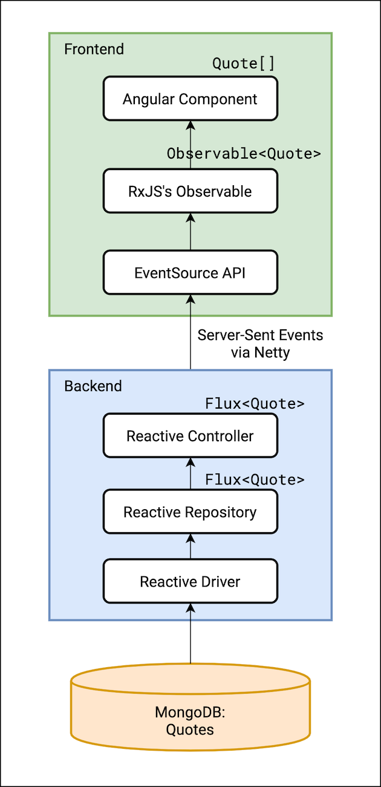

# Full Reactive Stack 

This repository contains backend and frontend projects that make use of **Reactive Web** patterns,
as explained in the mini book [Full Reactive Stack with Spring Boot 2, WebFlux, MongoDB and Angular](https://leanpub.com/full-reactive) and also in the [Full Reactive Stack series of posts](https://thepracticaldeveloper.com/full-reactive-stack).

## Get the mini-book

You can get a copy of the guide on LeanPub: [Full Reactive Stack with Spring Boot 2, WebFlux, MongoDB and Angular](https://leanpub.com/full-reactive).

## Components

### Spring Boot Reactive Web

A Spring Boot 2.3 application that retrieves data using **Spring Reactive Web (WebFlux)**, instead of using the standard Web MVC framework. It connects to a MongoDB database in a reactive way too.

Check [this blog post](https://thepracticaldeveloper.com/2017/11/04/full-reactive-stack-with-spring-webflux-and-angularjs/) for a short version of the guide's full chapter.

### Angular Reactive

A simple Angular application consumes the controller on the backend side using a reactive approach, Server-Sent Events and RxJS, so data is loaded on screen as soon as it's available.

[This blog post](https://thepracticaldeveloper.com/2017/11/04/full-reactive-stack-ii-the-angularjs-client/) contains a summary of the frontend's implementation.

### Docker

The docker folder contains a `docker-compose` file that runs the Mongo database, the backend application and the Angular application. It also contains a simplified version, `docker-compose-mongo-only.yml`, which runs only the MongoDB instance. This is useful in case you want to run the applications without docker (e.g. from your IDE).

## Running the applications with Docker

Make sure to build the applications first, from the `docker` folder:

`docker-compose build`

Then, you can run the set of containers with: 

`docker-compose up` 

After the services are executed, you can navigate to `localhost:4200` to see the applications running. If you're running Docker in a different machine (like when using a VM in Windows), replace `localhost` for the Docker machine IP.
